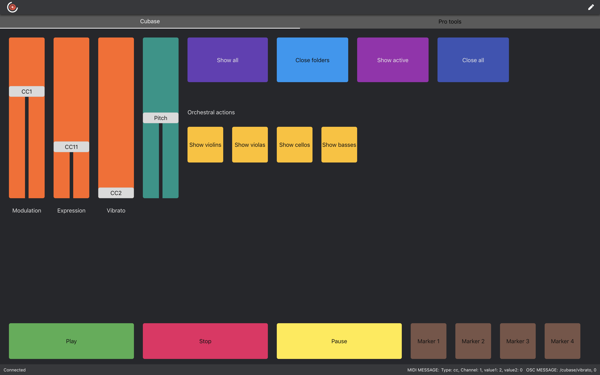
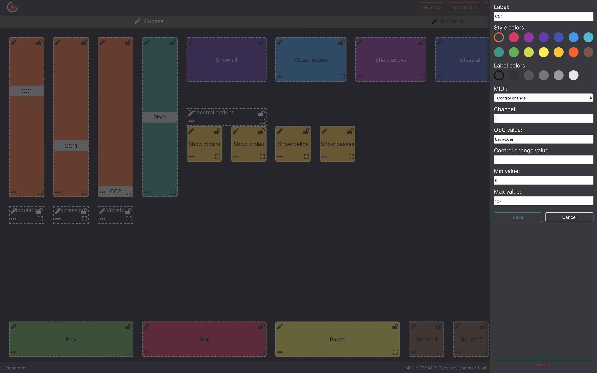
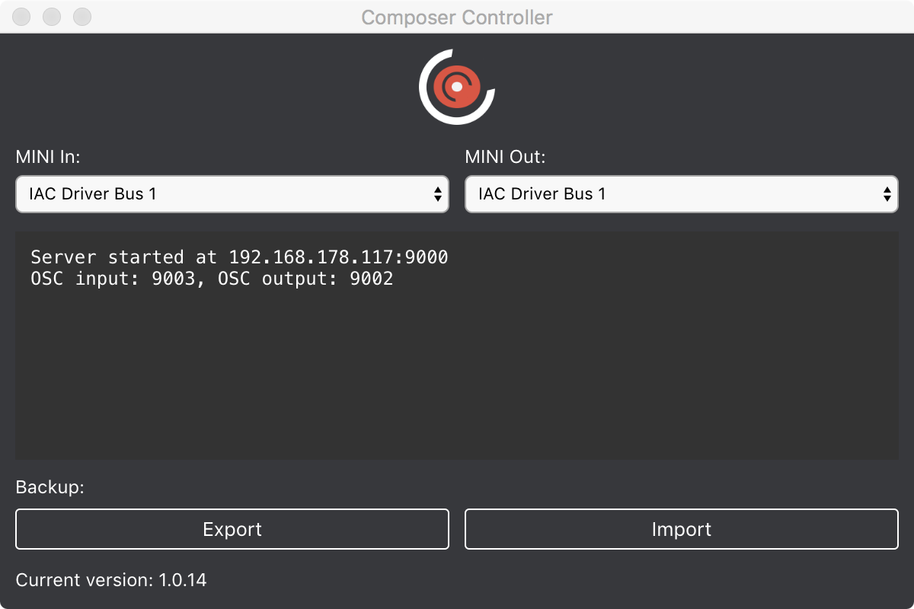
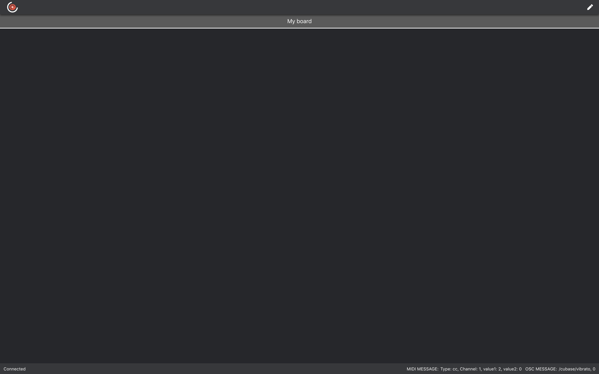
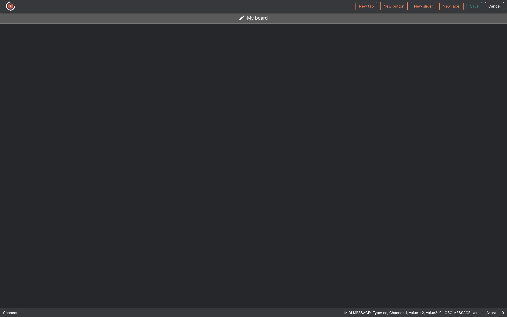
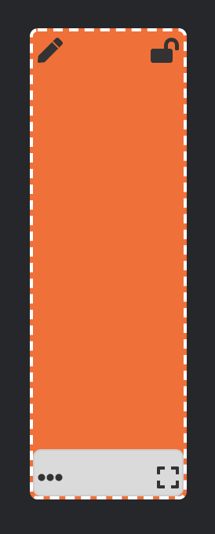
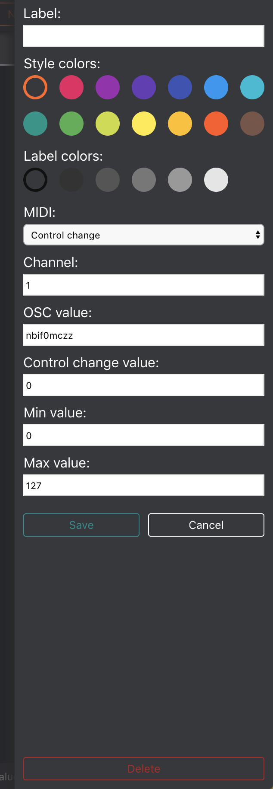

# Composer Controller

### MIDI and OSC controller by composer for composers.

**Read this first!**

**Composer Controller app at the moment is compatible for Mac only, but the board is visible in every Chrome/Firefox browser. 
In the near future I will develop the Windows app and a new compatibility for the Safari browser.**

### What Composer Controller is

Composer Controller is an all-in-one solution designed to facilitate composers workflow and to control your DAW or virtual instruments within every device that run a browser.
It has been inspired by [Junkie XL](https://www.youtube.com/watch?v=RSl_unnPab0``) and [Hans Zimmer](hans-zimmer.jpg) custom made touch screens solutions.
The goal is that it's no longer necessary to have a mobile device with an app downloaded from a store and a separate desktop software to edit your boards. 
With the same web interface now you can create your boards, assign MIDI and OSC messages, edit elements styles (buttons, sliders and labels) and monitoring messages. 
The Composer Controller desktop app is only aimed to serve through the network lan your boards, monitor error messages and backup/import your boards. 

### Installation

Go [here](https://github.com/alearcy/composer_controller/releases) and download the .dmg file from the latest release.

### First launch

The first time you launch the app, a window will appear that show the address that you have to copy and paste in your Chrome browser. 

Then, in your browser, you will see an empty board like this:

### Configure your board

Now you are able to click the top right pencil icon to switch in edit mode.

In edit mode you can create or rename tabs, buttons, faders and labels.

When you put an elements on the board you can edit, drag, lock or resize it respectively with the pencil, dots, lock and square icons.

Pressing the pencil icon you will entry in edit mode where you can change name, color, midi channel, MIDI values and OSC values.

We have two types of button messages: Note and Control Change (CC). For sliders we have Control Change and Pitchbend. 
OSC name will be automatically set with a random string, but you can change with whatever you want.

[CC0 1.0 (Public Domain)](LICENSE.md)
