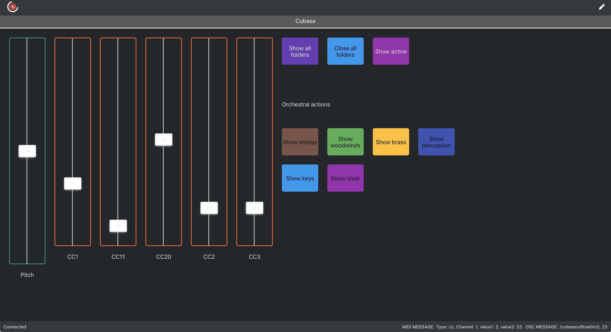

# Composer Controller

### MIDI controller by composer for composers.

**Read this first!**

**Composer Controller app at the moment is compatible for Mac only, but the board is visible in every OS browser. 
In the near future I will develop the Windows app.**

### What Composer Controller is

Composer Controller is an all-in-one solution designed to facilitate composers workflow and to control your DAW or virtual instruments within every device or touch screens that run in a browser.
I got inspiration by [Junkie XL](https://www.youtube.com/watch?v=RSl_unnPab0``) and [Hans Zimmer](hans-zimmer.jpg) custom made touch screens solutions.
The goal is that it'ss no longer necessary to have a mobile device with a dedicated app downloaded from a store and a separate desktop software to edit your boards. 
With the same web interface now you can create your boards, assign MIDI messages, edit elements styles (buttons, sliders and labels) and monitor messages. 
The Composer Controller desktop app is only aimed to serve through the network your boards, monitor error messages and backup/import your boards. 

### Installation

Go [here](https://github.com/alearcy/composer_controller/releases) and download the .dmg file from the latest release.

### First launch

The first time you launch the app, a window will show you the address you have to copy and paste in your browser. 

Then, in your browser, you will see an empty board like this:

### Configure your board

Now you are able to click the top right pencil icon to switch in edit mode.

In edit mode you can create or rename tabs, buttons, faders and labels. Also you can see a preview of two differents tablet sizes to fit correctly the elements in the board.

When you put an elements on the board you can edit, drag, lock or resize it respectively with the pencil, dots, lock and square icons.

Pressing the lock icon changes the element in a "non editable" mode until you press the lock icon again.

Pressing the pencil icon let you set the edit mode where you can change name, color, MIDI channel and MIDI values.

You have two types of button messages: Note and Control Change (CC). For sliders you have Control Change and Pitch. 

Pressing the delete button let you remove elements from the board. If you delete a tab every child elements will be deleted! 
So, remember to export a backup file from the server app.

## For developers only

Run `npm install` in both root and `/app` folder.

For serve locally in dev mode run:

`npm run start`

For build a dist package run:

`npm run dist`

### For the repository owner only:

Build and release new version with `npm version patch|minor|major` first and then `npm run release`.

This software is under [MIT License](LICENSE.md).
